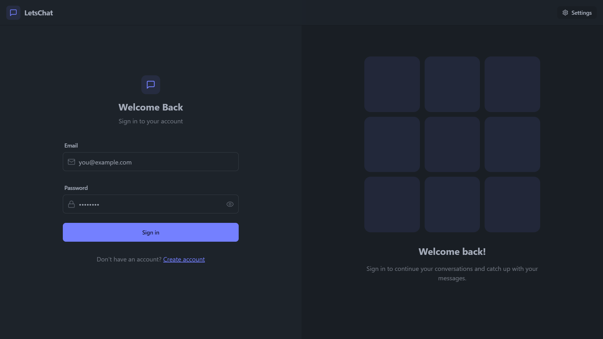
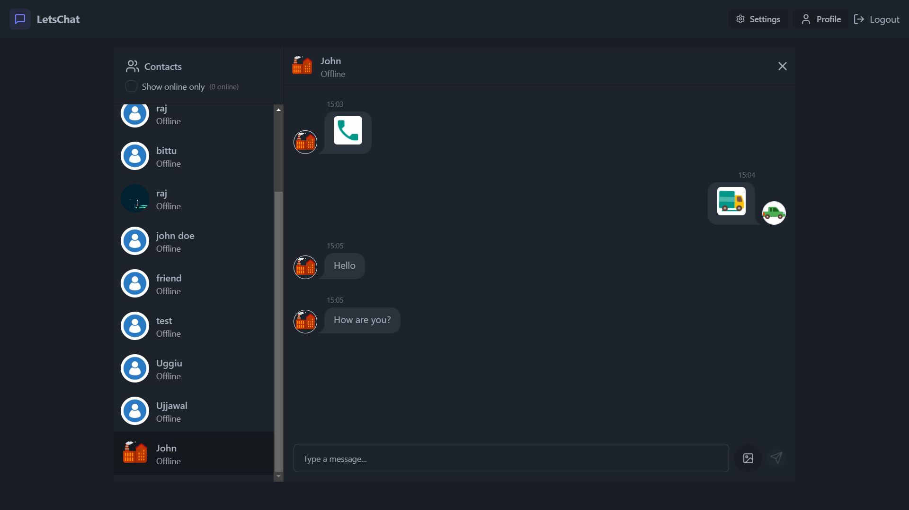
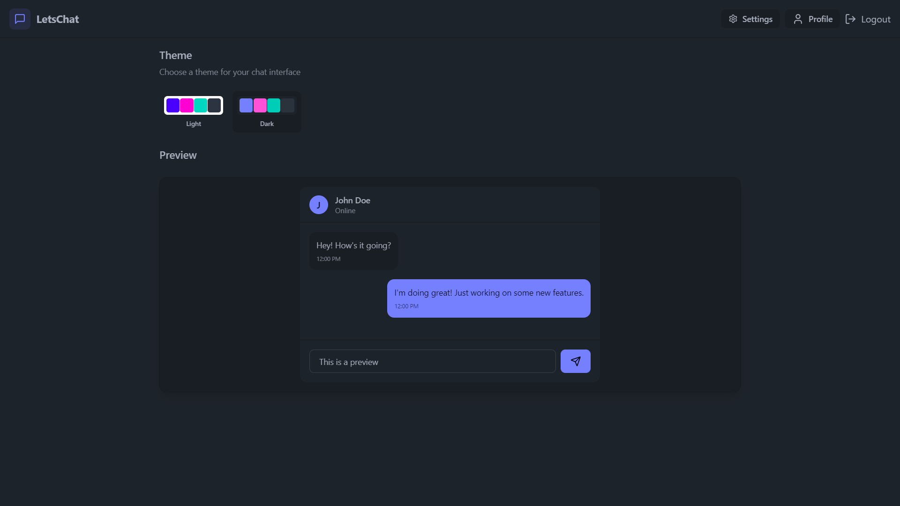
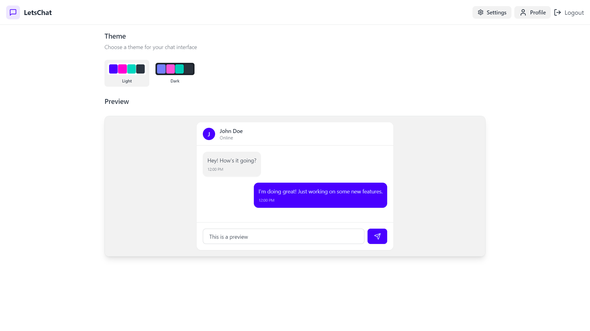
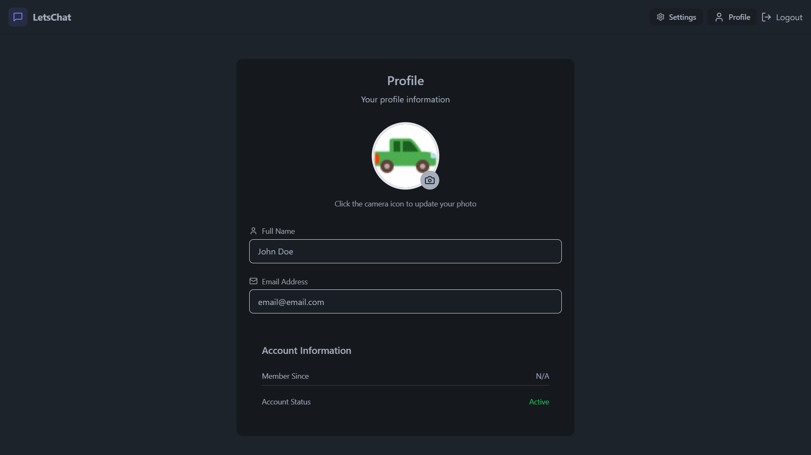

# Real-Time Chat Application

A modern, full-stack chat application built with React, Node.js, and PostgreSQL, featuring real-time messaging, user authentication, and image sharing capabilities.

## Features

- 🔐 User Authentication (Sign up, Login, Logout)
- 💬 Real-time messaging
- �� User profiles with customizable avatars
- 📸 Image sharing in chats
- 🎨 Modern UI with Tailwind CSS
- 🔄 Real-time updates using Socket.IO
- 📱 Responsive design for all devices

## Tech Stack

### Frontend
- React.js
- Tailwind CSS
- Socket.IO Client
- Axios
- Zustand (State Management)

### Backend
- Node.js
- Express.js
- PostgreSQL
- Sequelize ORM
- Socket.IO
- JWT Authentication
- Cloudinary (Image Storage)

### Authentication

### Chat Interface

### Theme Modes

*Dark mode interface*

*Light mode interface*

### User Profile
